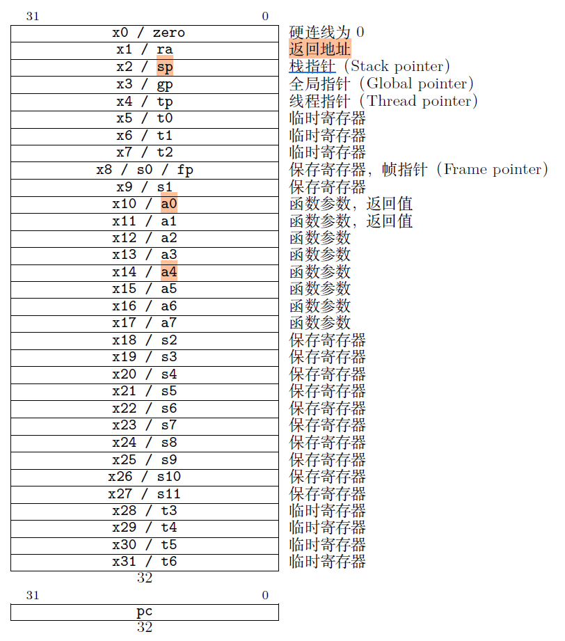
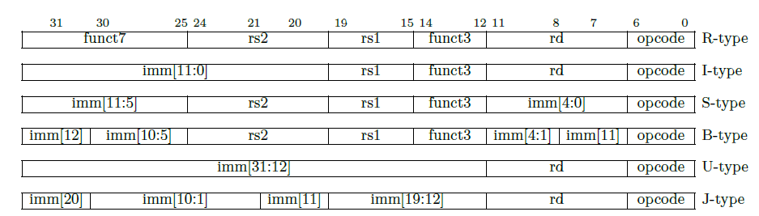
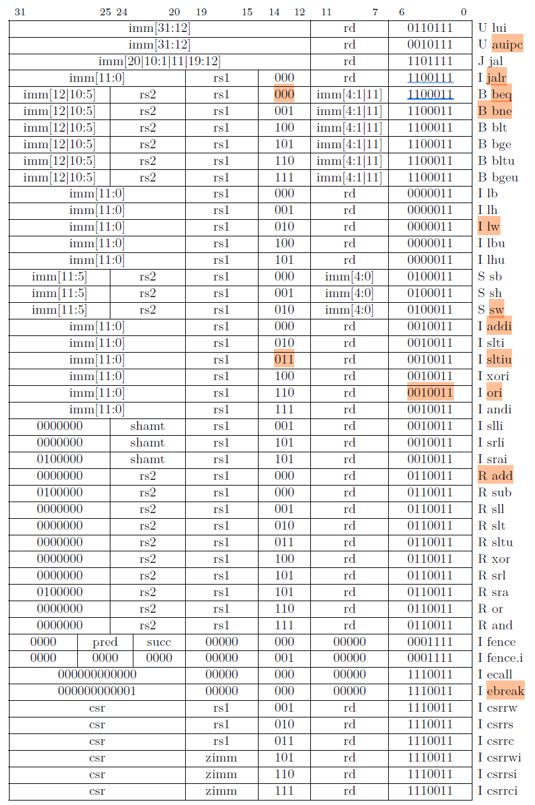
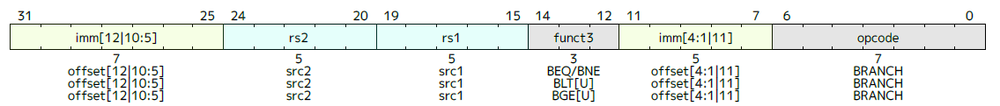
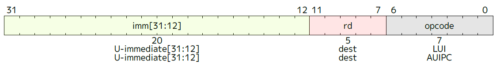
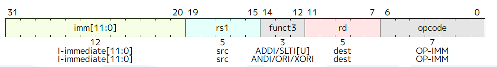
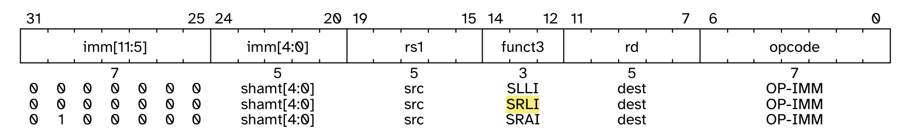

# instruction

## 寄存器列表

## 指令type

- R type: 寄存器间操作指令
	- integer register-register operation
- I type: load
	- integer register-immediate instruction
	- 从mem读到寄存器
	- lw(load word)
- S type: store
	- 从寄存器写到mem
	- sw(store word)
- B type: 分支指令
	- bne
	- bqe
- U type: 长立即数
	- auipc
	- lui
- J type

## B type条件分支指令

- bne
	- function
		- compare 2 registers
		- add offset to the address of the branch instruction
		- take the branch if rs1 unequals rs2
	- imm
		- 12bit
		- signed offsets
		- 2字节对齐
		- sign-extended
		- ±4KB

- beq
	- rs1 equals rs2

- blt[u]
	- rs1 less than rs2
	- using signed/unsigned comparison

- bge[u]
	- rs1 greater than/equal to rs2
	- using signed/unsigned comparison

## U type指令

- lui(load upper imm)
	- 将32bit imm放进rd, 低12bit填0

- aui(add upper imm to PC)
	- 将32bit imm加上PC放入rd

## I type指令

- addi

- sltiu(set less than imm)
	- 如果rs1 < imm，将rd设为1，否则为0
	- imm符号扩展
	- rs1和imm都被看做无符号数

- srli
	- 
	- 将rs1逻辑右移shamt个bit放入rd

## R type指令
- or
	- rd = rs1 | rs2

- xor
	- rd = rs1 ^ rs2
